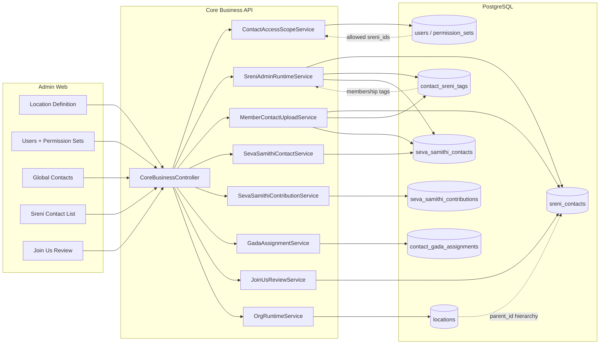

# Backend Contact, Scope, and Location Hierarchy



## Scope resolution

1. `CoreAdminAuthGuard` validates JWT.
2. `ContactAccessScopeService.resolveScope(actor)` loads `users` + permission set + role level.
3. List queries append SQL filters (`appendAllowedSreniSql`, `appendStahanSql`).
4. Per-contact mutations call `assertContactAccess(contactId, contextSreniId)`.
5. Seva Samithi context additionally requires `seva_samithi_contacts` registry row.

## Upload commit path

```
Excel file
  → MemberContactUploadService.preview
  → row decisions (insert | update | skip)
  → MemberContactUploadService.commit
  → sreni_contacts + contact_sreni_tags + household_members
  → SevaSamithiContactService.upsertRegistryEntry (household)
```

## File storage (not in DB)

- Seva documents: `{UPLOAD_DIR}/seva-contributions/{contactId}/{contributionId}/`
- Sreni documents: `{UPLOAD_DIR}/documents/{sreniId}/`
- Job resumes: gateway upload path per public-gateway module
