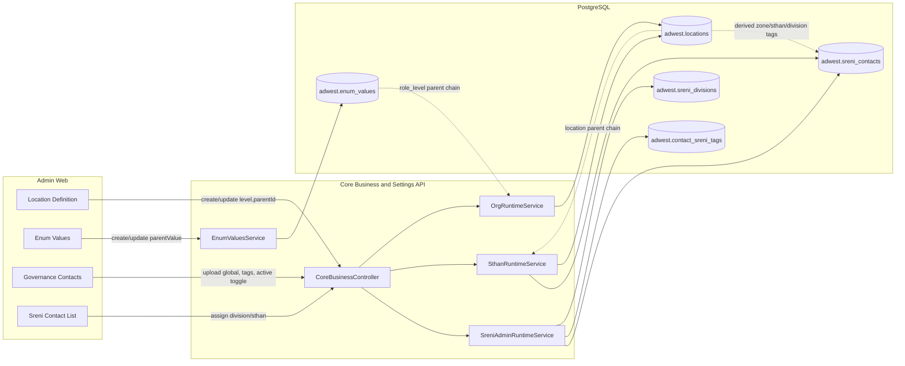

# Backend Contact and Location Hierarchy

```mermaid
flowchart LR
  subgraph Web[Admin Web]
    UI1[Location Definition]
    UI2[Enum Values]
    UI3[Governance Contacts]
    UI4[Sreni Contact List]
  end

  subgraph API[Core Business and Settings API]
    C1[CoreBusinessController]
    S1[SreniAdminRuntimeService]
    S2[SthanRuntimeService]
    O1[OrgRuntimeService]
    E1[EnumValuesService]
  end

  subgraph DB[PostgreSQL]
    T1[(adwest.locations)]
    T2[(adwest.enum_values)]
    T3[(adwest.sreni_contacts)]
    T4[(adwest.contact_sreni_tags)]
    T5[(adwest.sreni_divisions)]
  end

  UI1 -->|create/update level,parentId| C1
  UI2 -->|create/update parentValue| E1
  UI3 -->|upload global, tags, active toggle| C1
  UI4 -->|assign division/sthan| C1

  C1 --> S1
  C1 --> S2
  C1 --> O1

  O1 --> T1
  E1 --> T2
  S1 --> T3
  S1 --> T4
  S1 --> T5
  S2 --> T3
  S2 --> T1

  T2 -. role_level parent chain .-> O1
  T1 -. location parent chain .-> S2
  T1 -. derived zone/sthan/division tags .-> T3
```
