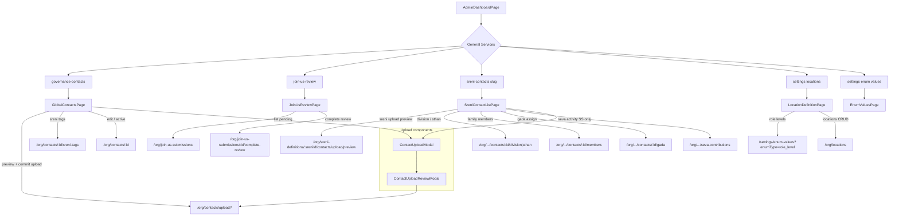

# Frontend Governance and Contacts Flow

## Page notes

- **GlobalContactsPage** — scope-filtered global list; primary upload entry for governance operators.
- **SreniContactListPage** — always scoped to URL Sreni; Seva Samithi shows Member Srenis column and Seva activity action.
- **JoinUsReviewPage** — menu grant `governance-join-us-review`; not part of per-Sreni contact list.
- **Contact access** — API enforces permission set + role level; UI assumes actor has matching `users` row.
