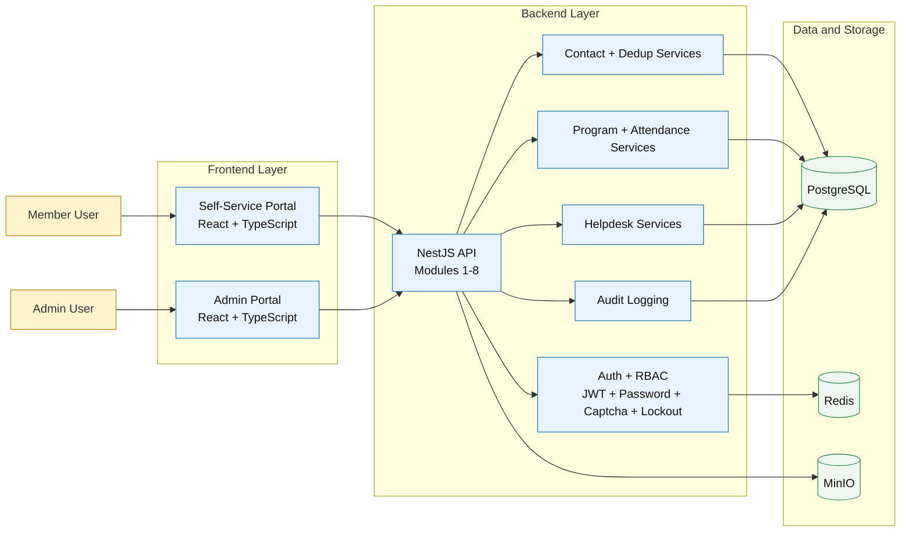

# System Architecture Diagram

## Scope
ADWest Zone Community Management Platform Core Business (Modules 1 to 8).

## Source Alignment
- business-intake/BRS_Zone_Requirement.md
- business-intake/BRS_Zone_Remaining_Requirement.md
- business-intake-modular/03-functional-modules/01-module-catalog.md

## Diagram Notes
- This is the baseline architecture for planning and stakeholder verification.
- Keep the diagram updated when integration, security, or deployment boundaries change.
- Use the change log section at the end for controlled revisions.

## Verification Checklist
- [ ] Module boundaries match current module catalog.
- [ ] Security controls (JWT, RBAC, captcha, lockout) are represented.
- [ ] Data stores (PostgreSQL, Redis, MinIO) are represented.
- [ ] No n8n or messaging dependencies are represented in current Core Business baseline.
- [ ] Diagram reflects current Core Business constraints.

## Change Log
| Version | Date | Updated By | Summary | Approved By |
|---|---|---|---|---|
| 1.0.0 | 2026-05-23 | Architecture Owner | Initial modular architecture baseline | Sponsor |
| 1.1.0 | 2026-05-24 | Architecture Owner | Removed n8n and messaging boundary from active baseline per product directive | Sponsor |
