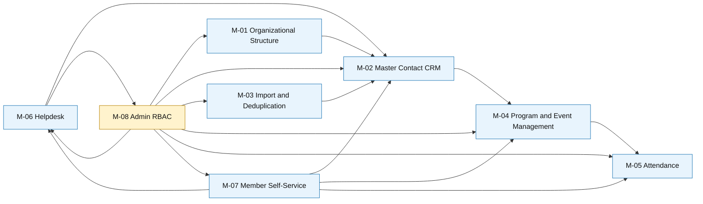

# Module Interaction Diagram

## Scope
Interaction boundaries across MVP modules M-01 to M-08.

## Source Alignment
- business-intake-modular/03-functional-modules/01-module-catalog.md
- business-intake-modular/09-development-handoff/02-module-to-sdlc-phase-map.md

## Diagram Notes
- The diagram focuses on module-level interaction, not class-level internals.
- Arrows represent primary dependency or data flow direction.

## Verification Checklist
- [ ] All eight MVP modules are represented.
- [ ] Dependency directions match current product behavior.
- [ ] RBAC control boundary is clearly visible.
- [ ] Self-service and helpdesk interaction paths are accurate.

## Change Log
| Version | Date | Updated By | Summary | Approved By |
|---|---|---|---|---|
| 1.0.0 | 2026-05-23 | Architecture Owner | Initial module interaction baseline | Sponsor |
