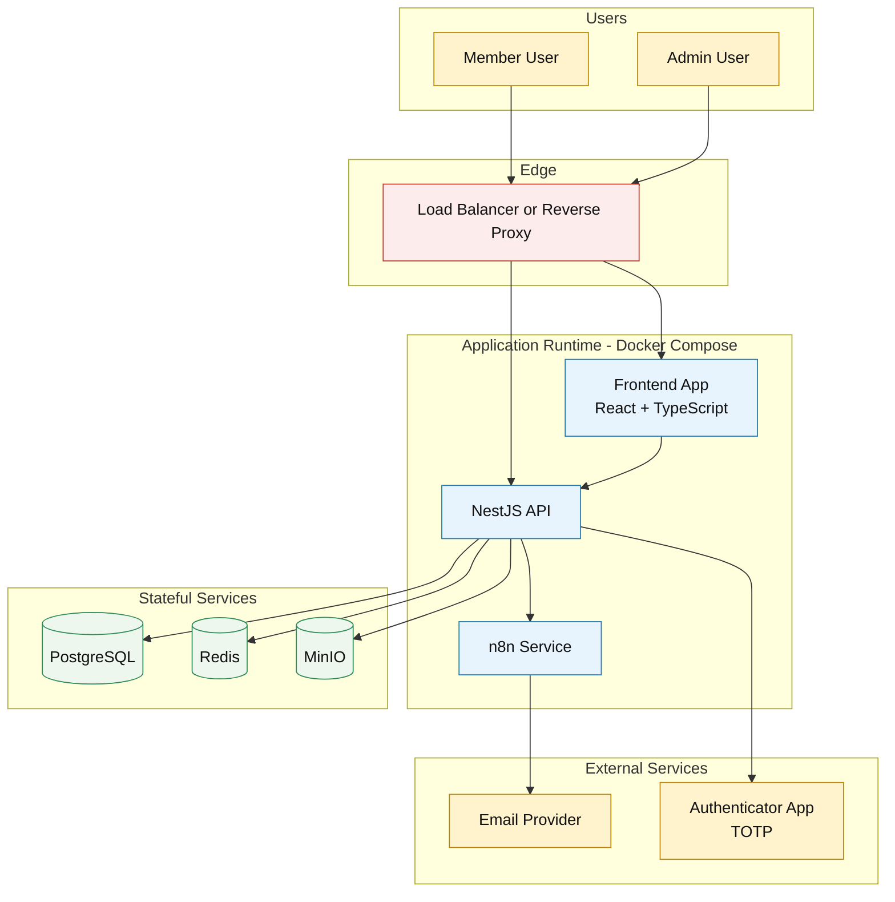

# Deployment and Runtime Diagram

## Scope
Runtime deployment view for MVP infrastructure and integration boundaries.

## Source Alignment
- business-intake/BRS_Zone_MVP_Plan.md
- business-intake-modular/06-integrations-and-automation/03-environment-readiness-checklist.md

## Diagram Notes
- This diagram shows containerized services and external dependency boundaries.
- Network segmentation can be refined later during infrastructure hardening.

## Verification Checklist
- [ ] Runtime services reflect MVP stack decisions.
- [ ] Data stores match approved architecture baseline.
- [ ] n8n and email integration boundary is clear.
- [ ] Authentication and MFA boundary is represented.

## Change Log
| Version | Date | Updated By | Summary | Approved By |
|---|---|---|---|---|
| 1.0.0 | 2026-05-23 | Architecture Owner | Initial deployment/runtime baseline | Sponsor |
