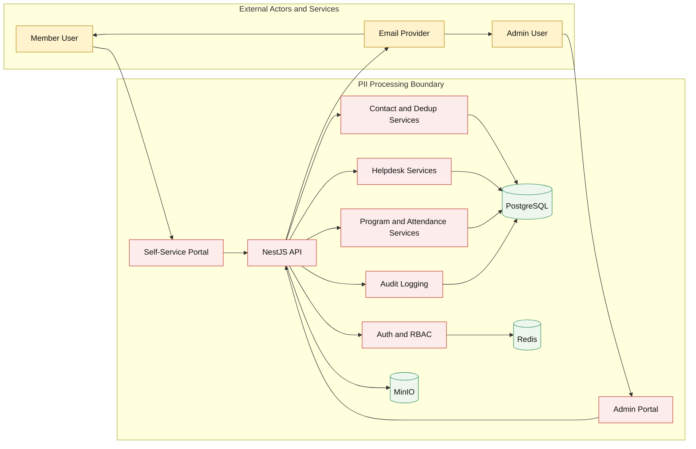

# Data Flow and PII Boundary Diagram

## Scope
Core Business data flow for contact, self-service, helpdesk, and notification processes with PII boundary markers.

## Source Alignment
- business-intake/BRS_Zone_Requirement.md
- business-intake/BRS_Zone_Remaining_Requirement.md
- business-intake-modular/04-cross-cutting-requirements/01-security-and-privacy.md
- business-intake-modular/05-data-domain/03-critical-data-rules.md

## Diagram Notes
- PII boundary encloses systems that store or process personal member data.
- External services should receive minimum required data only.
- This diagram is intended for compliance and security review updates.

## Data Classification Notes
- High sensitivity: Name, phone, email, address, date of birth, helpdesk attachments.
- Medium sensitivity: Attendance and registration history linked to contact IDs.
- Operational metadata: Workflow status and delivery events.

## Control Checklist
- [ ] PII data flow paths are minimized and justified.
- [ ] External email payload excludes unnecessary sensitive fields.
- [ ] Audit logs capture sensitive updates without exposing full PII in logs.
- [ ] Data retention and erasure process references are current.
- [ ] Boundary changes are reviewed by compliance owner.

## Change Log
| Version | Date | Updated By | Summary | Approved By |
|---|---|---|---|---|
| 1.0.0 | 2026-05-23 | Architecture Owner | Initial PII boundary and data-flow baseline | Compliance Lead |
| 1.1.0 | 2026-05-25 | Architecture Owner | Removed n8n flow from current-phase PII boundary baseline | Compliance Lead |
