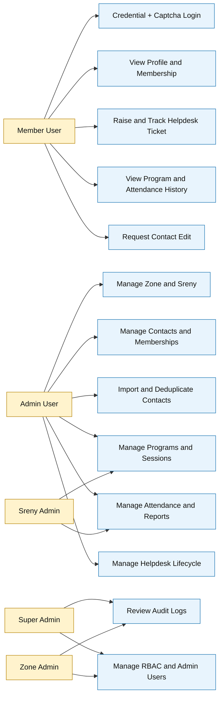

# Use Case Diagram

## Scope
Actor-to-capability mapping for the Core Business functional scope.

## Verification Checklist
- [ ] All Core Business modules are represented by at least one use case.
- [ ] Member and admin actor boundaries are clear.
- [ ] RBAC-sensitive admin capabilities are separated.
