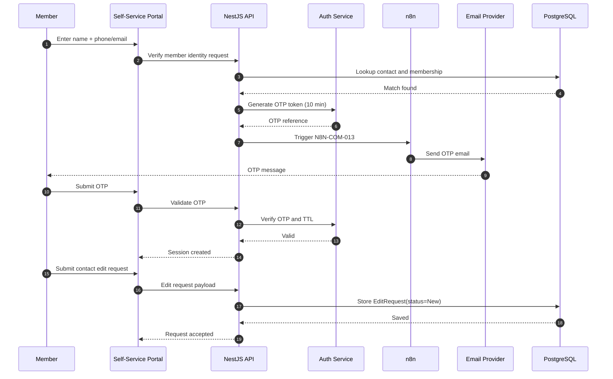

# Sequence Diagram: Self-Service OTP and Edit Request

## Scope
Primary user journey for member verification, OTP login, profile access, and edit request.

## Verification Checklist
- [ ] OTP expiry is enforced at 10 minutes.
- [ ] Edit requests are stored for admin approval flow.
- [ ] Notification trigger aligns to N8N-COM-013.
