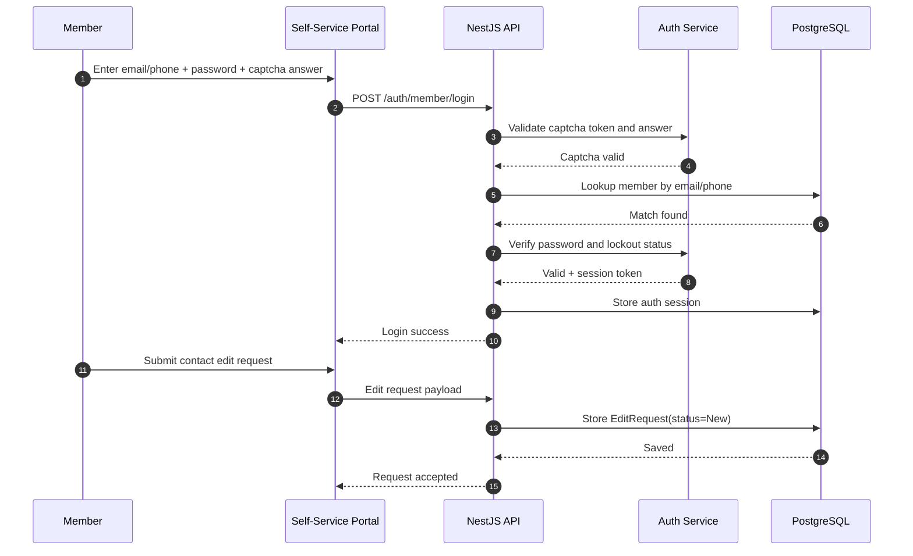

# Sequence Diagram: Self-Service Password + Captcha and Edit Request

## Scope
Primary user journey for member authentication using identifier + password + captcha, profile access, and edit request.

## Verification Checklist
- [ ] Captcha validation is required before authentication.
- [ ] Failed login attempts enforce account lockout.
- [ ] Sessions are persisted for authenticated members.
- [ ] Edit requests are stored for admin approval flow.
