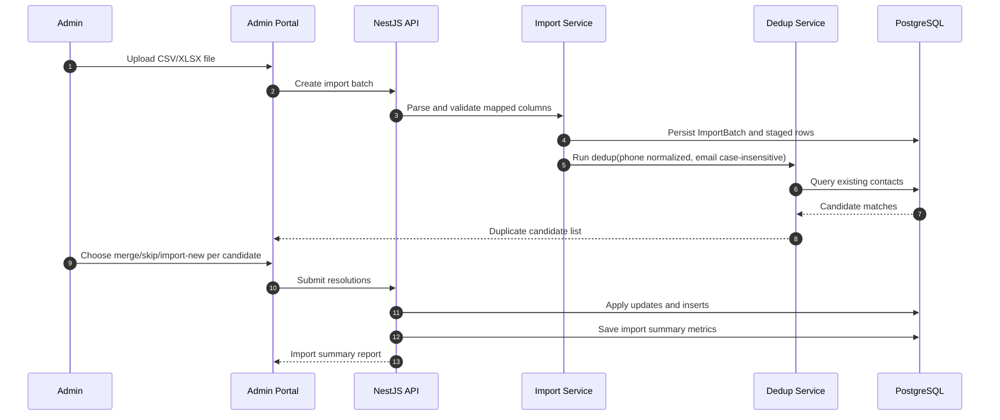

# Sequence Diagram: Import, Dedup, and Merge

## Scope
Admin flow for contact import, duplicate detection, and merge decision handling.

## Verification Checklist
- [ ] Accepted file types limited to CSV and XLSX.
- [ ] Dedup rules match intake scope (no fuzzy matching).
- [ ] Resolution outcomes are traceable in summary report.
