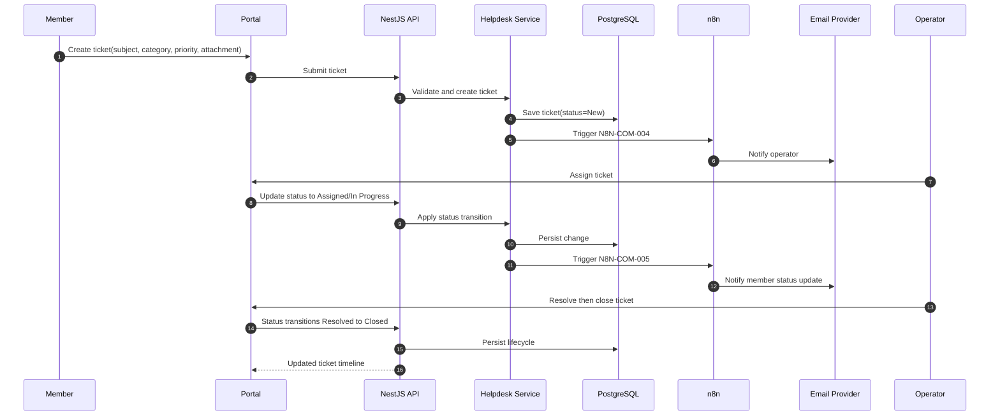

# Sequence Diagram: Helpdesk Ticket Lifecycle

## Scope
Ticket lifecycle from member submission to closure with email notifications.

## Verification Checklist
- [ ] Lifecycle matches New, Assigned, In Progress, Resolved, Closed.
- [ ] Notification triggers align to configured workflows.
- [ ] Ticket comments and assignment are auditable.
