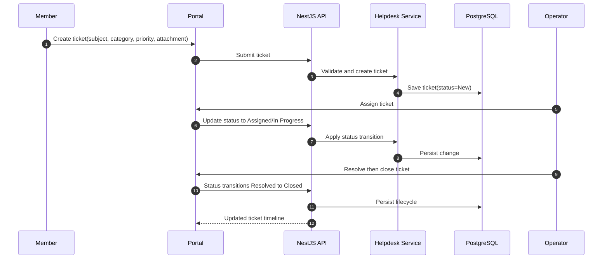

# Sequence Diagram: Helpdesk Ticket Lifecycle

## Scope
Ticket lifecycle from member submission to closure without external notification dependency in current phase.

## Verification Checklist
- [ ] Lifecycle matches New, Assigned, In Progress, Resolved, Closed.
- [ ] Lifecycle works without n8n or external messaging dependency.
- [ ] Ticket comments and assignment are auditable.
