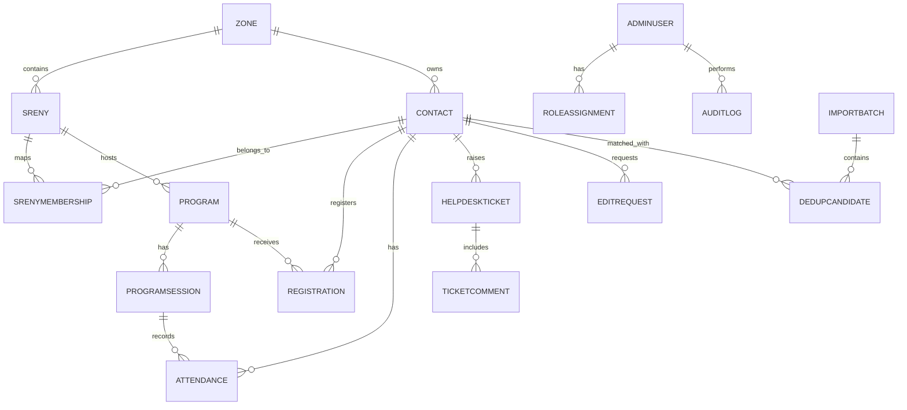

# Domain Entity Relationship Diagram

## Scope
Core Business core domain entities and their primary relationships.

## Verification Checklist
- [ ] Entity list aligns with Core Business data model baseline.
- [ ] Relationship cardinality matches expected behavior.
- [ ] Sensitive entities are included in audit and access reviews.
