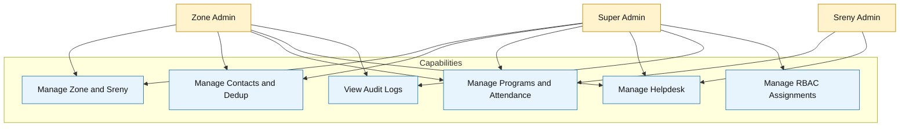

# RBAC and Access Boundary Diagram

## Scope
Role-to-capability boundary for Super Admin, Zone Admin, and Sreny Admin.

## Verification Checklist
- [ ] Only three MVP roles are represented.
- [ ] Audit log access limited to Zone Admin and Super Admin.
- [ ] Assignment boundaries match admin scope constraints.
