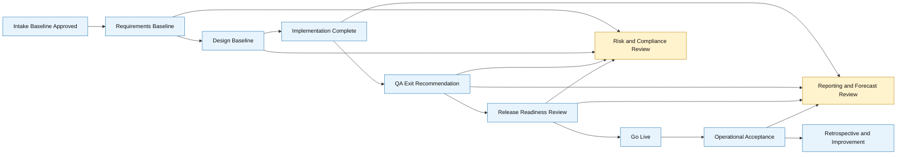

# Release and Governance Flow Diagram

## Scope
Planning and governance flow from intake baseline through release and operations acceptance.

## Verification Checklist
- [ ] Governance gates are complete and ordered.
- [ ] Risk/compliance and reporting controls overlay each major gate.
- [ ] Flow aligns with 16-week phased plan.
