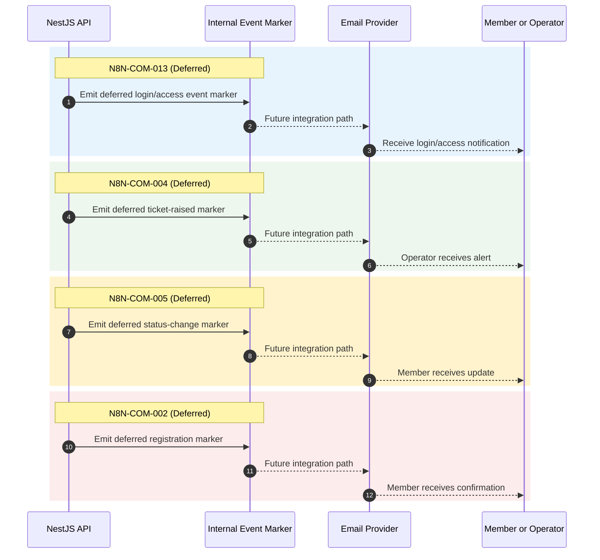

# Deferred Notification Workflow Sequence Diagram

## Deferred in Current Phase
- Status: Deferred.
- Activation path: Future phase only via approved scope change.

## Scope
Deferred notification workflow blueprint for future-phase activation only.

## Current Phase Rule
- No n8n integration is active.
- No messaging workflow is executed at runtime.

## Verification Checklist
- [ ] All four deferred workflow IDs are documented.
- [ ] Current phase has no active runtime dependency on this diagram.
- [ ] Future activation requires approved scope change.
