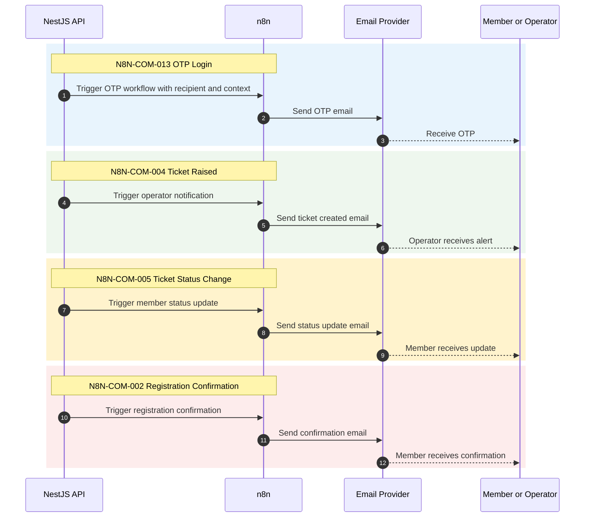

# Notification Workflow Sequence Diagram

## Scope
MVP notification workflows N8N-COM-013, 004, 005, and 002.

## Verification Checklist
- [ ] All four MVP workflows are represented.
- [ ] Trigger source is the API business event.
- [ ] Email delivery is the only notification channel in MVP.
